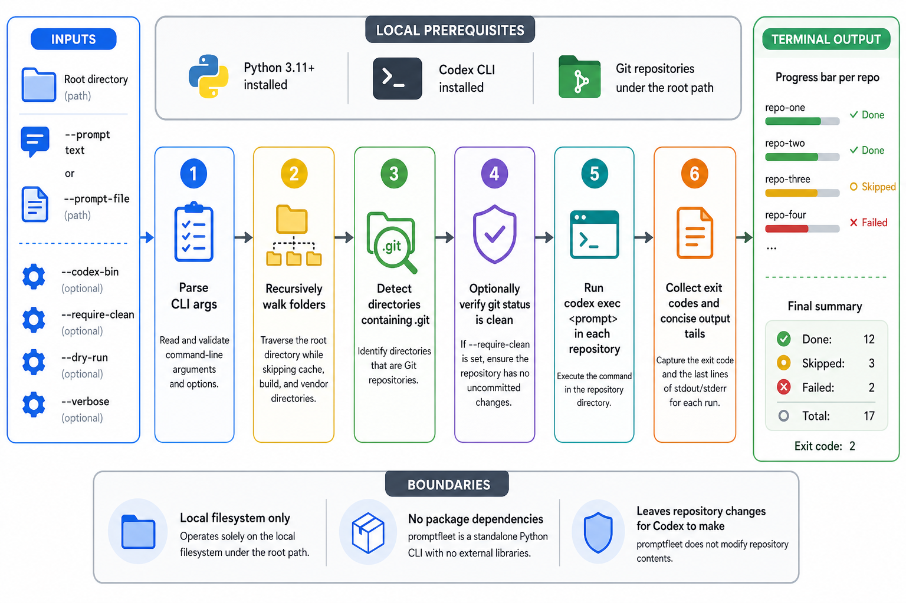

# promptfleet

promptfleet is a small Python CLI for running one Codex prompt across every git repository under a root directory.

Use it when you keep many local repos in one folder and want Codex to apply the same instruction in each repository, with optional clean-working-tree checks and concise terminal progress.

## Install

```bash
git clone https://github.com/tsilva/promptfleet.git
cd promptfleet
uv sync
uv run promptfleet --help
```

Run a dry scan before executing Codex:

```bash
uv run promptfleet /path/to/repos --prompt "Update the README" --dry-run
```

Run the prompt in each discovered repository:

```bash
uv run promptfleet /path/to/repos --prompt "Update the README" --require-clean
```

## Commands

```bash
uv sync                         # create the local environment
uv run promptfleet --help       # show CLI options
uv run promptfleet ROOT --prompt "..." --dry-run
uv build                        # build source and wheel distributions
```

## Notes

- Requires Python 3.11 or newer.
- Requires the Codex CLI on `PATH`, unless you pass a different executable with `--codex-bin`.
- Accepts either `--prompt` text or `--prompt-file`.
- Skips common cache, build, virtualenv, and dependency folders while scanning.
- With `--require-clean`, repos with staged or unstaged changes are skipped.
- Without `--verbose`, Codex output is hidden unless a repo fails; failures print the last few non-empty output lines.
- The project currently has no third-party Python dependencies.

## Architecture



## License

No license file is currently included.
