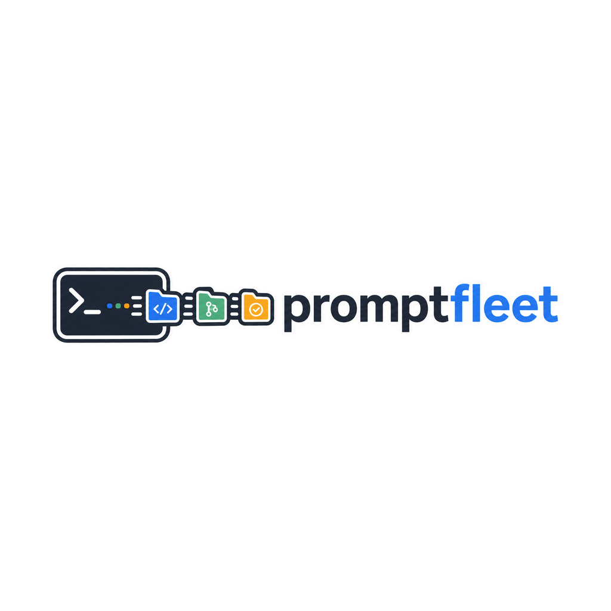
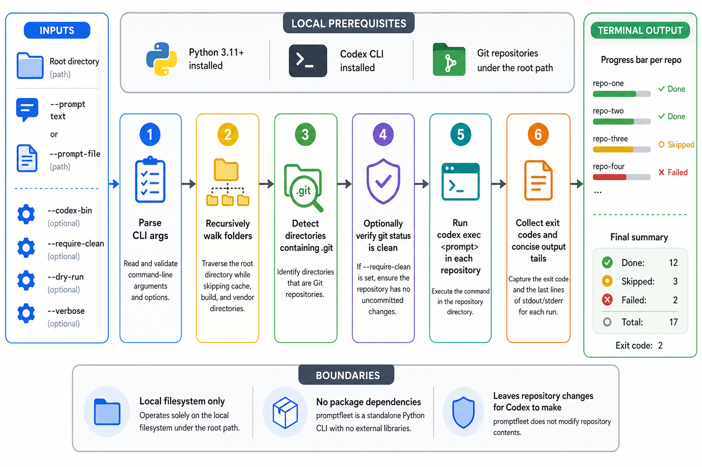

<!-- archive-repo:deprecation-notice:start -->
> [!WARNING]
> **Deprecated**
>
> I've moved Promptfleet's main use case of maintaining guidelines across multiple repositories to [RepoMan](https://github.com/tsilva/repoman).
<!-- archive-repo:deprecation-notice:end -->

<p align="center">
  
  <br />
  <!-- repo-tagline:start -->
  <strong>🚀 Run one Codex prompt across every local repo 🚀</strong>
  <!-- repo-tagline:end -->
</p>

<p align="center">
  <a href="https://github.com/tsilva/promptfleet/actions/workflows/secret-scanning.yml"></a>
</p>

promptfleet is a Python CLI for developers who want to apply the same Codex instruction across many local Git repositories. Use it for occasional bulk changes, such as updating documentation or applying a repository policy. Give it a parent directory and a prompt; it discovers repositories, runs Codex in each one, and reports progress.

## Install

Requires Python 3.11+, [uv](https://docs.astral.sh/uv/), Git, and a working Codex CLI.

```bash
git clone https://github.com/tsilva/promptfleet.git
cd promptfleet
uv sync
uv run promptfleet --help
```

Run `uv run promptfleet --help` to see all options.

## Use

Replace `/path/to/repos` with your repositories' parent directory. Preview the targets before running Codex:

```bash
uv run promptfleet /path/to/repos --prompt "Update the README" --dry-run
```

Run the same instruction in each clean repository, with up to four workers:

```bash
uv run promptfleet /path/to/repos --prompt "Update the README" --require-clean --workers 4
```

Or read the instruction from a file:

```bash
uv run promptfleet /path/to/repos --prompt-file /path/to/prompt.md --require-clean
```

For reusable policies, invoke an installed Codex skill through `--prompt` so the instructions stay centralized. Canonical maintenance instructions live in `$run-maintenance`; promptfleet does not bundle copies.

## Commands

```bash
uv sync                    # create or update the local environment
uv run promptfleet --help  # show CLI options
uv build                   # build source and wheel distributions
```

## Notes

- Runs `codex exec` in each repository's current working directory. Use `--codex-bin` if Codex is not on `PATH`.
- Accepts exactly one of `--prompt` or `--prompt-file`. Prompt files use explicit paths and UTF-8 text.
- Scans recursively, skips hidden and common cache/build/dependency folders, and stops descending once it finds a repository. Repositories under `.archived` are skipped.
- `--require-clean` skips repositories with staged, unstaged, or untracked files. Without it, Codex runs in the existing working tree.
- `--workers N` runs up to `N` repositories in parallel; the default is one. Each worker starts its own Codex process.
- Prints a final count of successful, skipped, and failed runs. `done` means Codex exited successfully; verify the resulting changes before publishing them.
- `--verbose` shows Codex output. Otherwise, failed runs print only the last eight non-empty output lines.
- Returns exit code `1` if any Codex run fails. Skipped repositories do not count as failures.
- The CLI has no third-party runtime dependencies.

## Architecture



## License

[MIT](LICENSE)
